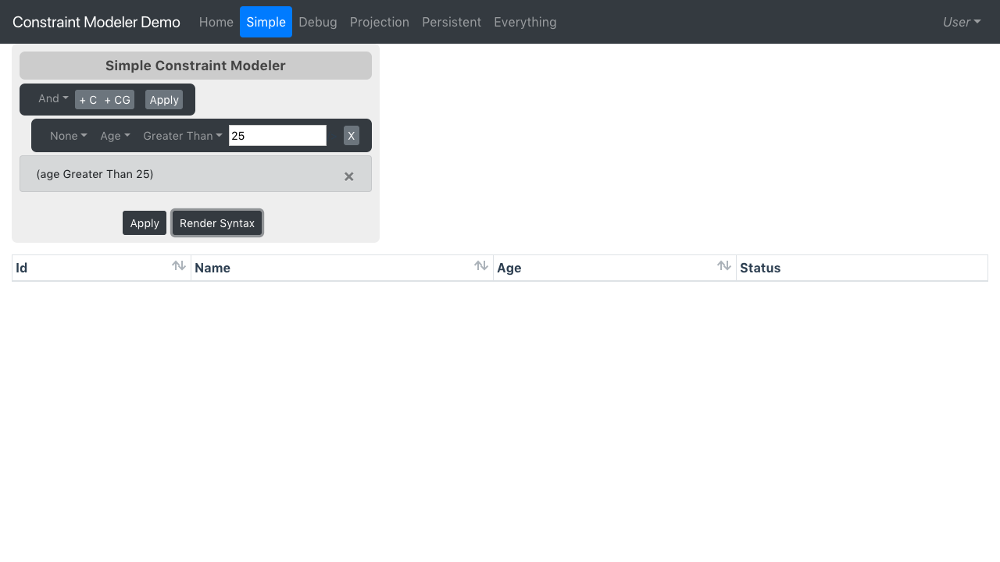
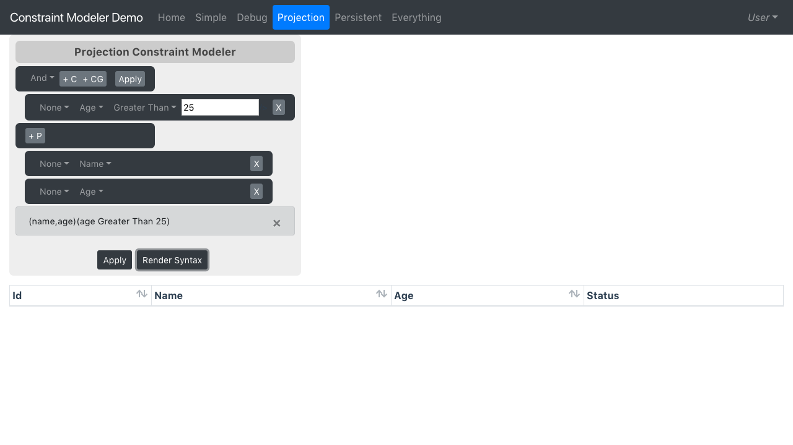
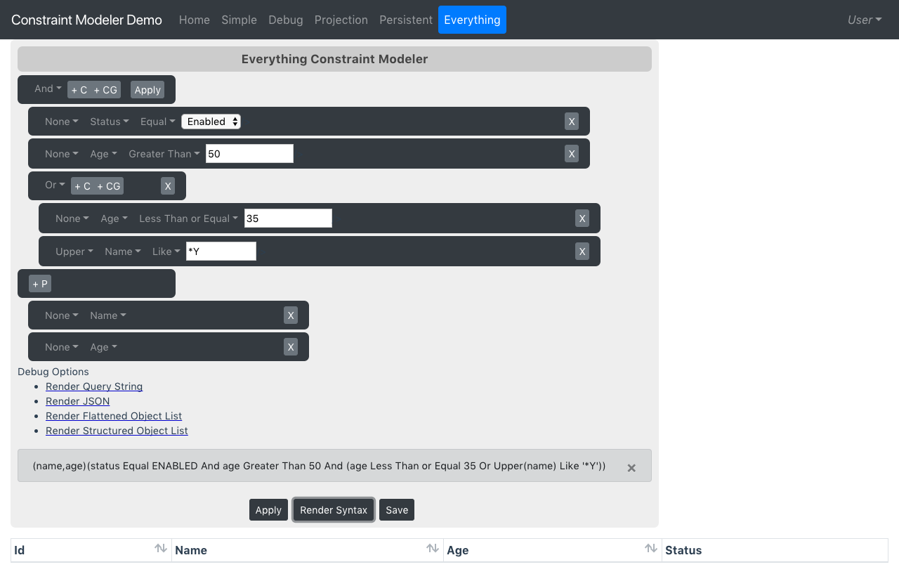

# Constraint Modeler

A Vue 3 component for building constraint and projection query models. It renders a visual query builder, loads field metadata from an application-provided resource, validates constraints, and emits applied query results back to the host app.

## Demo

[View the demo](https://tedberg.github.io/constraint-modeler/index.html)

## Install

```bash
npm install @tedberg/constraint-modeler
```

Import the library CSS once in your app entry:

```ts
import "@tedberg/constraint-modeler/dist/constraint-modeler.css";
```

## Plugin Usage

```ts
import { createApp } from "vue";
import ConstraintModeler from "@tedberg/constraint-modeler";
import "@tedberg/constraint-modeler/dist/constraint-modeler.css";
import App from "./App.vue";

createApp(App).use(ConstraintModeler).mount("#app");
```

```vue
<template>
  <ConstraintModeler
    object-name="User"
    :constraint-modeler-resource="resource"
    @apply-constraints-to-data="rows = $event.data"
  />
</template>
```

## Direct Component Usage

```vue
<script setup lang="ts">
import { ref } from "vue";
import { ConstraintModeler, ConstraintModelerResource } from "@tedberg/constraint-modeler";
import "@tedberg/constraint-modeler/dist/constraint-modeler.css";

const rows = ref([]);
const resource = new ConstraintModelerResource();
</script>

<template>
  <ConstraintModeler
    title="User Filters"
    object-name="User"
    :constraint-modeler-resource="resource"
    @apply-constraints-to-data="rows = $event.data"
  />
</template>
```

## Resource Contract

The component needs a resource object that implements these methods:

```ts
type ConstraintModelerResourceLike = {
  loadValueList(serverDataType: string): Promise<unknown>;
  loadProperties(objectName: string): Promise<unknown>;
  validateConstraintModeler(className: string, constraintList: string): Promise<unknown>;
  loadResultWithConstraints(className: string, queryString: string): Promise<unknown>;
};
```

You can extend the default class:

```ts
import { AbstractConstraintModelerResource } from "@tedberg/constraint-modeler";

class ApiConstraintModelerResource extends AbstractConstraintModelerResource {
  loadValueList(serverDataType: string) {
    return fetch(`/objects/${serverDataType}/values`).then((r) => r.json());
  }

  loadProperties(objectName: string) {
    return fetch(`/api/objects/${objectName}/classInfo`).then((r) => r.json());
  }

  validateConstraintModeler(className: string, constraintList: string) {
    const query = encodeURIComponent(constraintList);
    return fetch(`/objects/${className}/constraintModeler/validate?constraintList=${query}`).then(
      (r) => r.json(),
    );
  }

  loadResultWithConstraints(className: string, queryString: string) {
    return fetch(`/objects/${className}?${queryString}`).then((r) => r.json());
  }
}
```

`loadProperties` should return `propertyList` and/or `multiPropertyList` arrays. Each property should include `path`, `displayName`, `simpleDataType`, and `dataType`.

## Props And Events

Common props:

- `objectName` - required server-side object/class name.
- `constraintModelerResource` - resource implementation used to load metadata, validate, and apply.
- `title` - optional header text.
- `showDebug` - shows debug render actions.
- `exposeProjectionModeler` - enables projection selection.
- `initialModelJsonObject` - preloads a saved constraint/projection model.
- `saveFunction` - enables the Save button when provided.

Event:

- `applyConstraintsToData` - emitted with the result returned by `loadResultWithConstraints`.

## Theming

The library CSS is isolated for host apps:

- Tailwind utilities are prefixed with `cm:`.
- Design tokens are scoped to `.constraint-modeler` and `.constraint-modeler-portal`.
- Tailwind Preflight is not shipped in the library CSS.

Override `--cm-*` variables to match your app:

```css
.constraint-modeler,
.constraint-modeler-portal {
  --cm-background: var(--background);
  --cm-foreground: var(--foreground);
  --cm-primary: var(--primary);
  --cm-primary-foreground: var(--primary-foreground);
  --cm-bar: var(--cm-primary);
  --cm-bar-foreground: var(--cm-primary-foreground);
  --cm-secondary: var(--secondary);
  --cm-secondary-foreground: var(--secondary-foreground);
  --cm-success: var(--success);
  --cm-destructive: var(--destructive);
  --cm-border: var(--border);
  --cm-ring: var(--ring);
}
```

The published CSS subpath includes its own declaration, so TypeScript consumers can import it without adding a local CSS module shim.

## Examples

Simple constraint:



Projection modeler:



Constraint and projection model:



## Compatibility

- Vue 3.5+
- Modern ESM bundlers such as Vite, Rollup, and Webpack
- Browser/CDN usage through the UMD build published at `dist/constraint-modeler.umd.js`
- TypeScript declarations are published with the package
